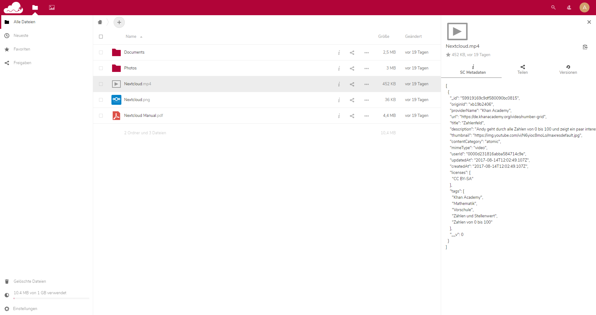

SCMeta
========

**Plugin for [Nextcloud](https://nextcloud.com) and [ownCloud](https://owncloud.org) to edit [Schul-Cloud](https://schul-cloud.org) Content Metadata**

Installation
------------

**Nextcloud**

In your Instance, simply navigate to »Apps«, choose the category »Files«, find the SCMeta app and enable it.

OR

**ownCloud**
- Copy the scmeta folder in the app directory of owncloud.
- If not already done, rename the app-folder to "SCMeta" - causes overwise an sql error.
- Enable this app in the admin interface.

Usage
-----

TODO

Compatibility
-------------

- I only tested the app for the Nextcloud version 14.